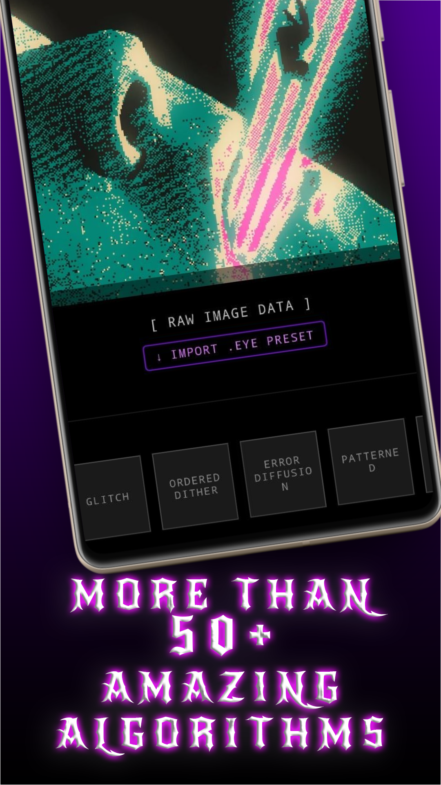
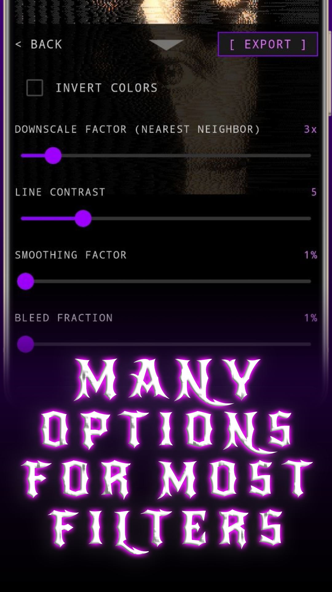
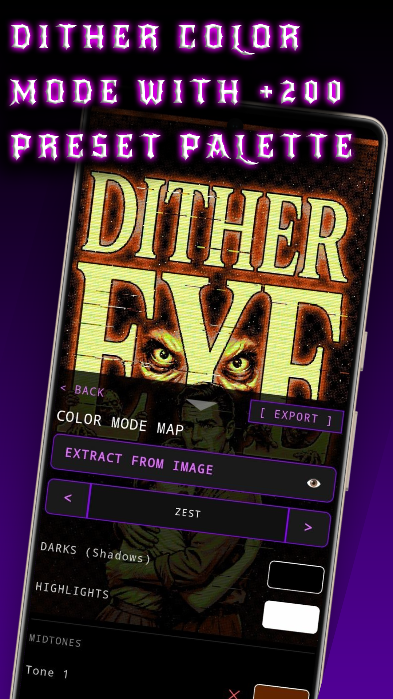
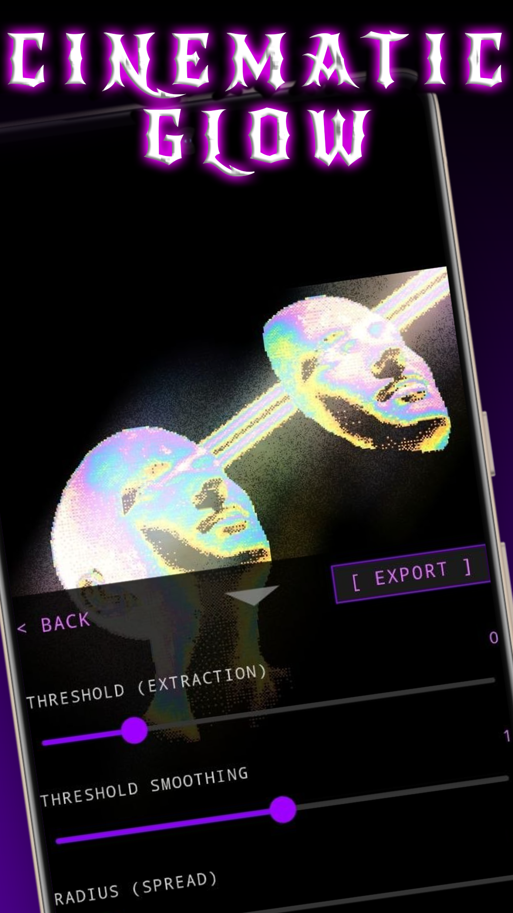
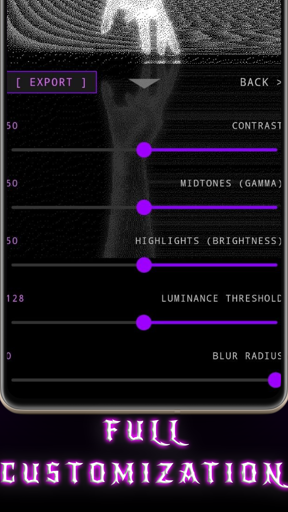
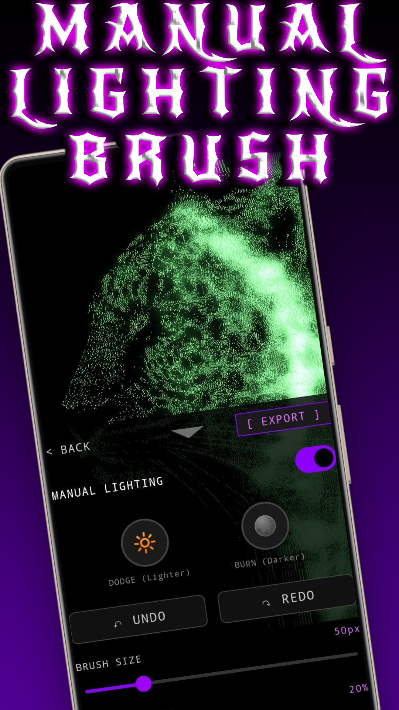
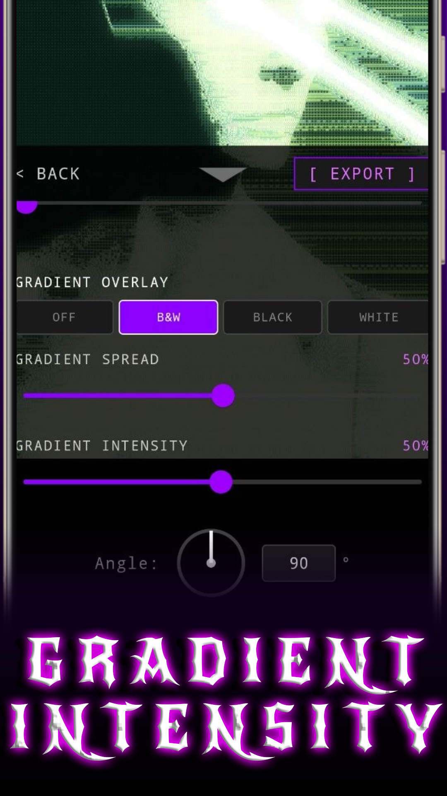
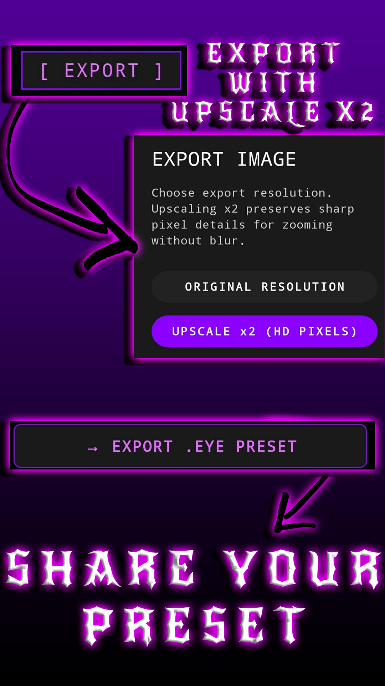

# DitherEYE

Transform your photos into stunning pixel-art and retro dithered masterpieces directly on Android.

DitherEYE is a powerful offline image editor featuring 50+ dithering algorithms, advanced color palette controls, glow effects, pixelation tools, and professional image adjustments designed for artists, designers, and retro graphics enthusiasts.

> ⚠️ DitherEYE is a closed-source project. This repository is used for releases, updates, bug reports, feature requests, and community showcases.

  

  

  <strong>Create retro visuals. Experiment with palettes. Push dithering further.</strong>

---

## ✨ Features

### 🎨 50+ Dithering Filters

Explore a huge collection of professional dithering algorithms including:

* Floyd-Steinberg
* Atkinson
* Jarvis-Judice-Ninke
* Stucki
* Burkes
* Sierra
* Sierra Lite
* Two-Row Sierra

...and many more.

---

### 🌈 Advanced Color Dithering

Create unique artwork using:

* Color dithering
* Custom palettes
* Palette size control
* Retro color simulation
* Pixel-art color workflows

---

### 🔥 Creative Effects

Take your designs beyond standard dithering:

* Glow effects
* Gradient overlays
* Manual lighting controls
* Noise effects
* Blur radius controls

---

### 🛠 Powerful Editing Controls

Fine-tune every detail:

* Dither strength
* Threshold
* Brightness
* Contrast
* Saturation
* Gamma
* Pixel size
* Horizontal flip
* Vertical flip

---

### ⚡ Built for Speed

* Real-time editing experience
* Mobile-first design
* Optimized Android performance
* Offline processing
* Fast PNG exporting

---

📸 Screenshots

 Experience DitherEYE's interface, powerful editing tools, and 50+ dithering filters. 

<table align="center"> <tr> <td align="center">  </td>

<td align="center">  </td>

<td align="center">  </td>

<td align="center">  </td> </tr>

<tr> <td align="center">  </td>

<td align="center">  </td>

<td align="center">  </td>

<td align="center">  </td> </tr> </table>

---

## 🚀 Downloads

### Google Play

Coming Soon

### APKPure

Coming Soon

### Aptoide

Coming Soon

### Uptodown

Coming Soon

---

## 👥 Community

Share your creations, report issues, suggest features, and stay updated.

Reddit Community:

https://www.reddit.com/r/DITHEREYE/

Show us what you create with DitherEYE.

---

## ❓ FAQ

### Is DitherEYE free?

Yes. DitherEYE is completely free to use.

### Does it work offline?

Yes. No internet connection is required for image editing.

### Is the app open source?

No. DitherEYE is a closed-source application.

### Why is there an ad during export?

A single advertisement may appear while exporting images. Exporting takes a few seconds, and this helps support future development and the creation of an iOS version.

### What formats can I export?

PNG.

### What Android version is required?

Android 8.0 or newer.

---

## 💡 Feature Requests

Want a new filter, palette, or tool?

Open an issue and let us know what you'd like to see in future updates.

---

## 🐞 Bug Reports

Found a problem?

Create an issue with:

* Device model
* Android version
* Screenshot (if possible)
* Steps to reproduce

---

## ❤️ Support Development

If you enjoy DitherEYE, consider:

* Leaving a review
* Sharing your artwork
* Reporting bugs
* Suggesting new features
* Joining the Reddit community

Every bit of feedback helps improve the app.

---

Made with ❤️ for pixel artists, designers, and retro graphics enthusiasts.

